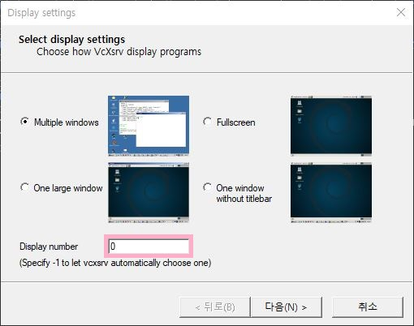
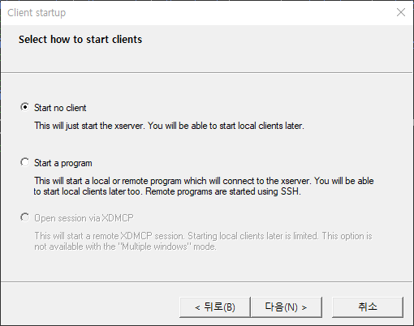
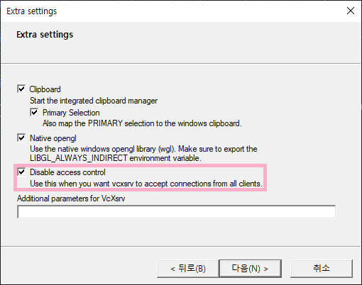
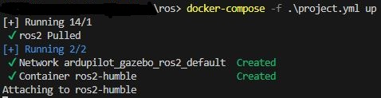
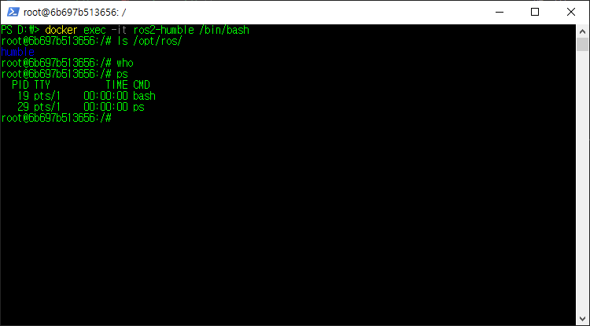
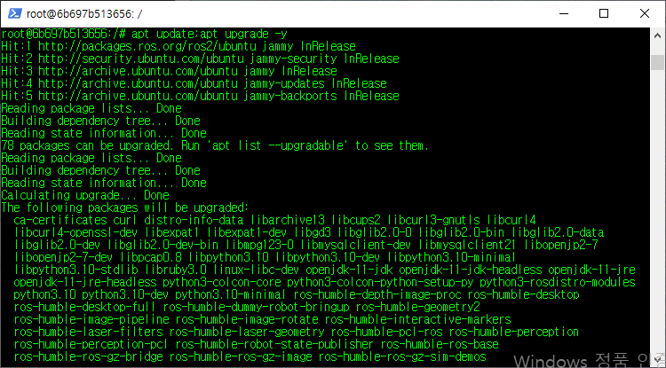
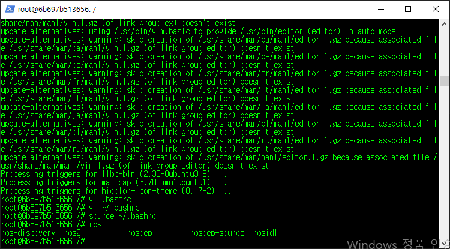
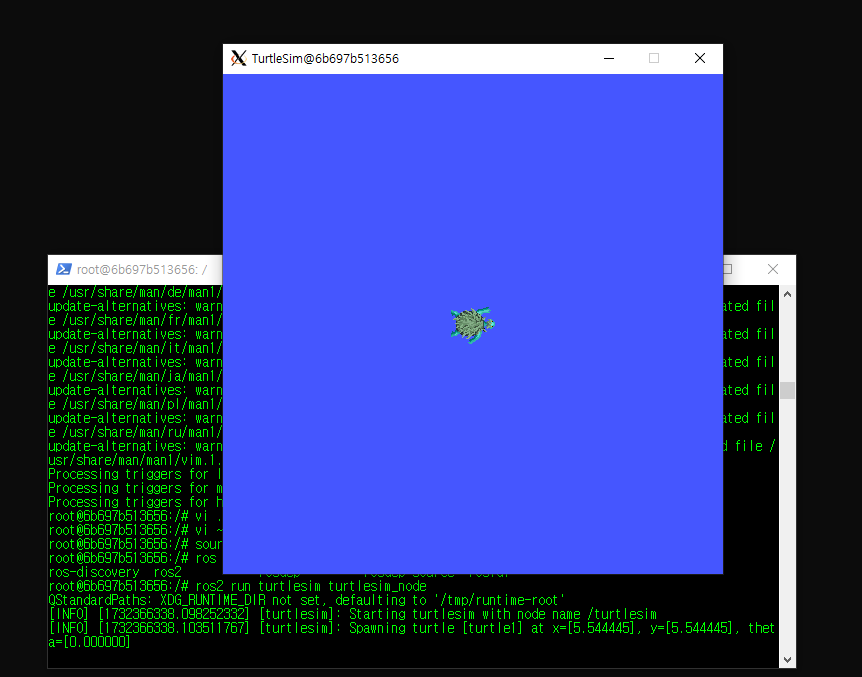

# Project for run ros2 ardupilot gazebo sitl with docker

## requirements
1. docker
2. VcXsrv Windows X Server

# WINDOWS

### Ready for project
This document was written on the assumption that aleardy you are friendly with docker.
1. Download the X Server(VcXsrv)
2. Execute Xlaunch
3. Set up the Display number as 0, from Display setting screen.

4. Noting to do with the Client startup screen.

5. Check the 'Disable access control' from Extra setting screen.

6. Finally, finish the X Server's configuration.

### Create docker image and setups
1. execute `docker-compose -f .\project.yml up`

2. now, Execute docker ros with `docker exec -it ros2-humble /bin/bash`.

3. update and upgrade the Linux...

3. Add `source /opt/ros/humble/setup.bash` into `~/.bashrc` and source it!

4. Then you can try the turtlesim like this`ros2 run turtlesim turtlesim_node`

<!-- 
https://github.com/HarryKito/ros2_sitl.git
-->
