# Project for run ros2 ardupilot gazebo sitl with docker

## requirements
1. docker
2. VcXsrv Windows X Server

# Development Environments
### Notice
This document was written on the assumption that aleardy you are friendly with docker.  
[Windows](#WINDOWS)  
[MacOS](#Mac)  

# WINDOWS
### Ready for project
1. Download the X Server(VcXsrv)
2. Execute Xlaunch
3. Set up the Display number as 0, from Display setting screen.
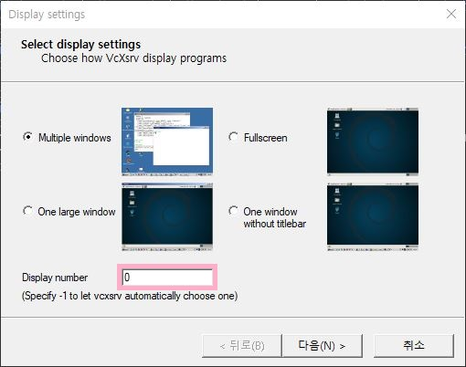
4. Noting to do with the Client startup screen.
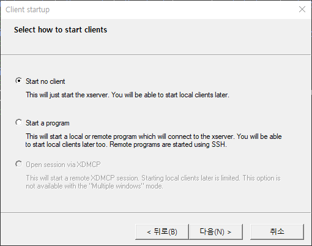
5. Check the 'Disable access control' from Extra setting screen.
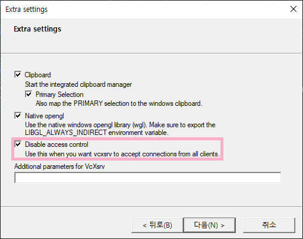
6. Finally, finish the X Server's configuration.

### Create docker image and setups
1. execute `docker-compose -f .\project.yml up`
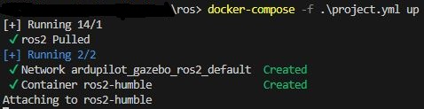

2. now, Execute docker ros with `docker exec -it ros2-humble /bin/bash`.
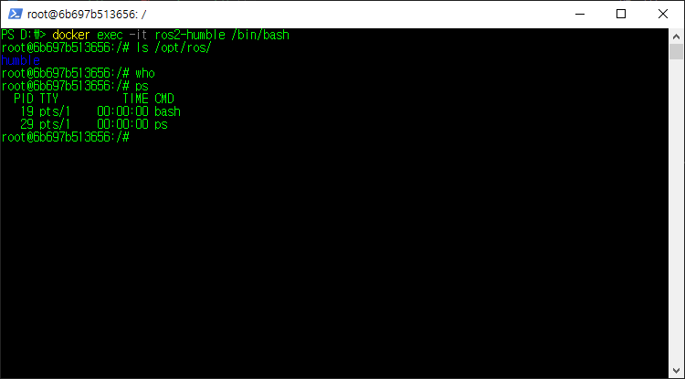
3. update and upgrade the Linux...
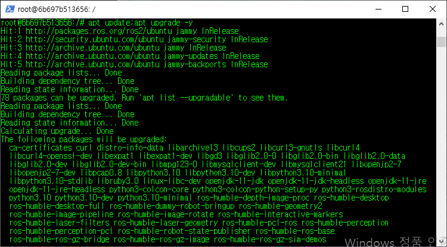
3. Add `source /opt/ros/humble/setup.bash` into `~/.bashrc` and source it!
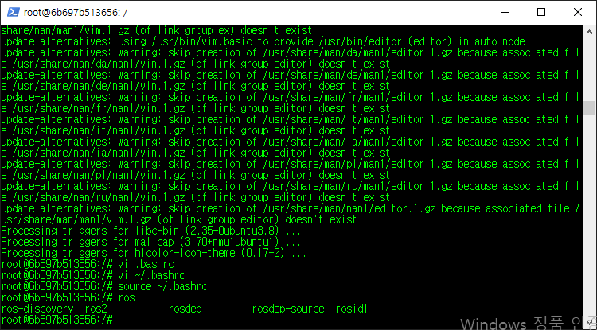
4. Then you can try the turtlesim like this`ros2 run turtlesim turtlesim_node`
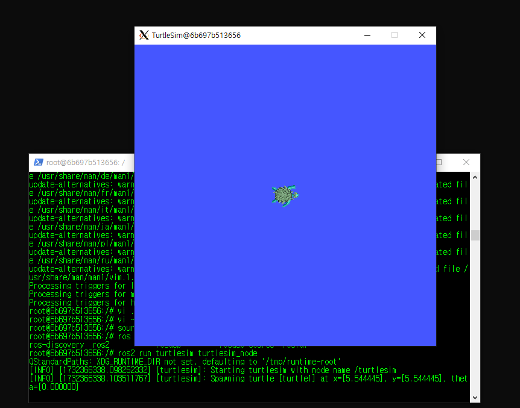

# Mac
### Ready for project
1. Download the xquartz from [xquartz.org](xquartz.org)  
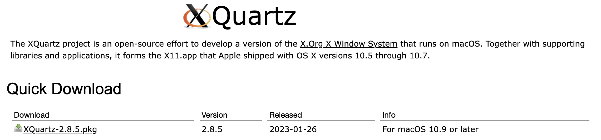
2. Now, execute the XQuartz
3. Now, Launch the XQuartz, and under the menu, select Preferences, on the security tab and check the "Allow connections from network clients".
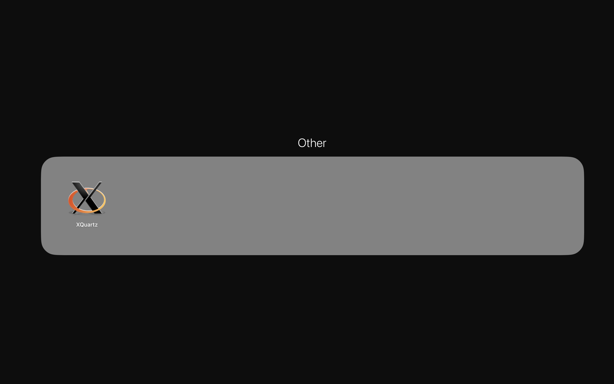
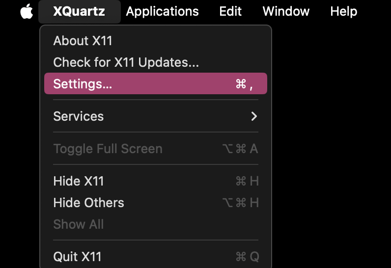
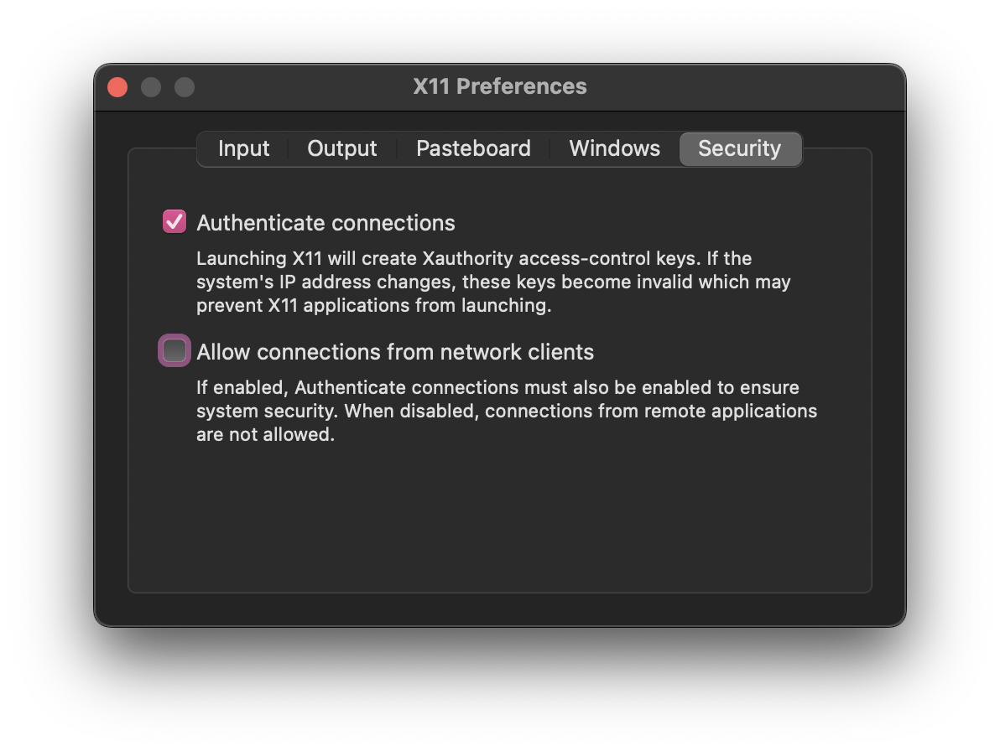

4. Finally, run `xhost + ${hostname}` on terminal.  
>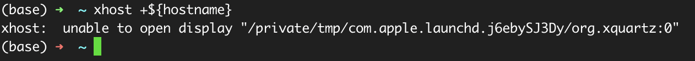
> [*** Issue... ***](#issue)

5. execute `docker-compose -f .\project.yml up`
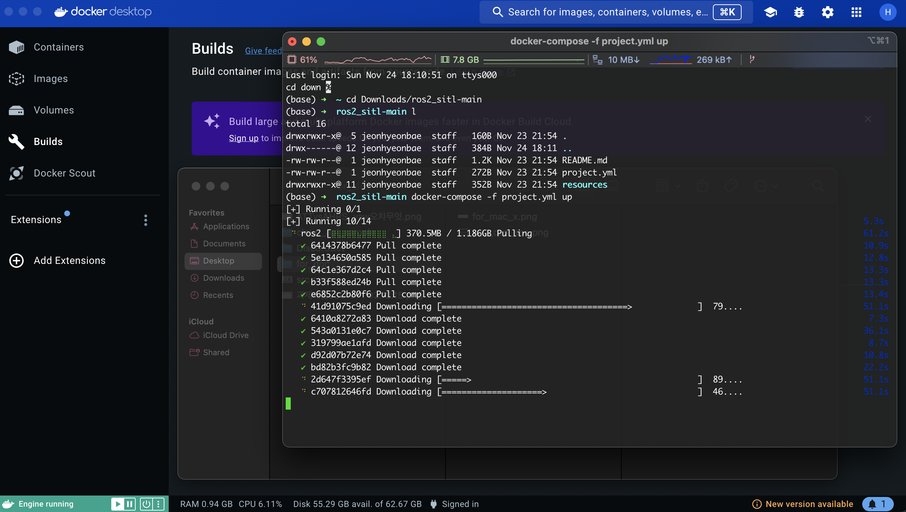
6. And then you can execute docker ros with `docker exec -it ros2-humble /bin/bash`.
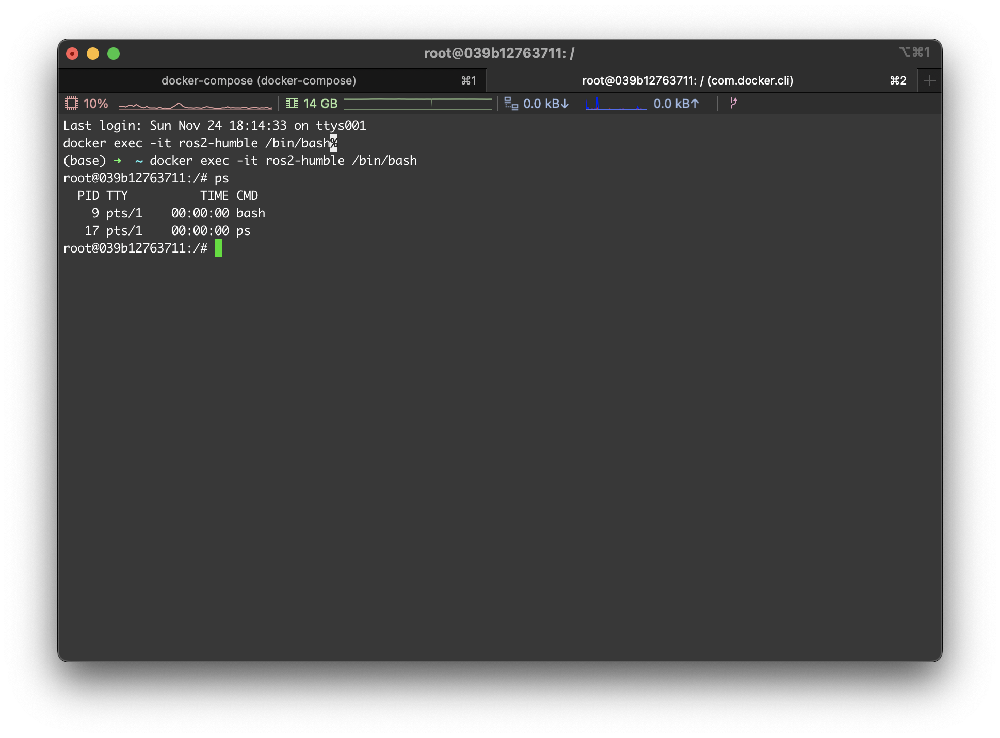
7. So... update & upgrade & add ros environment on bashrc!
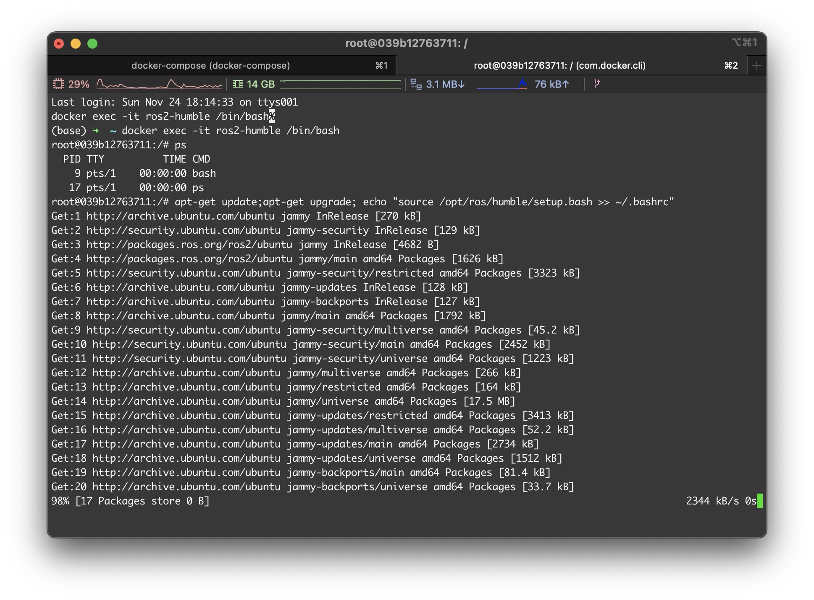
8. Then you can try the turtlesim like this`ros2 run turtlesim turtlesim_node`
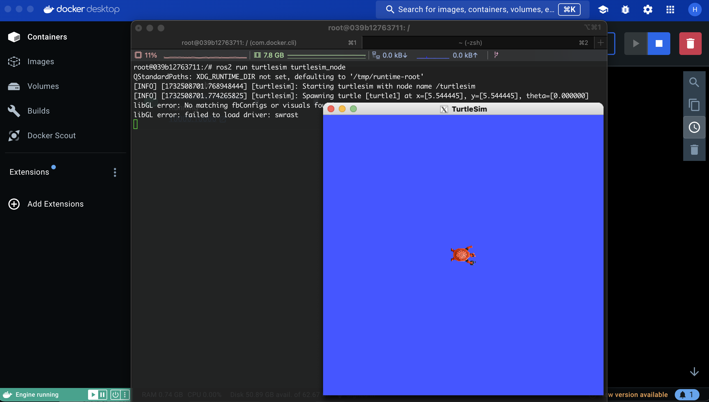

### issue
> In my case, it doesn't work well.
> So I just tried to launch the XQuartz terminal,
> 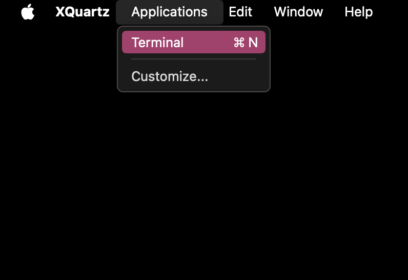
> and run `xhost + ${hostname}` again, and the result like this.
> 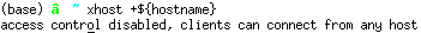
> But after
<!-- 
https://github.com/HarryKito/ros2_sitl.git
-->